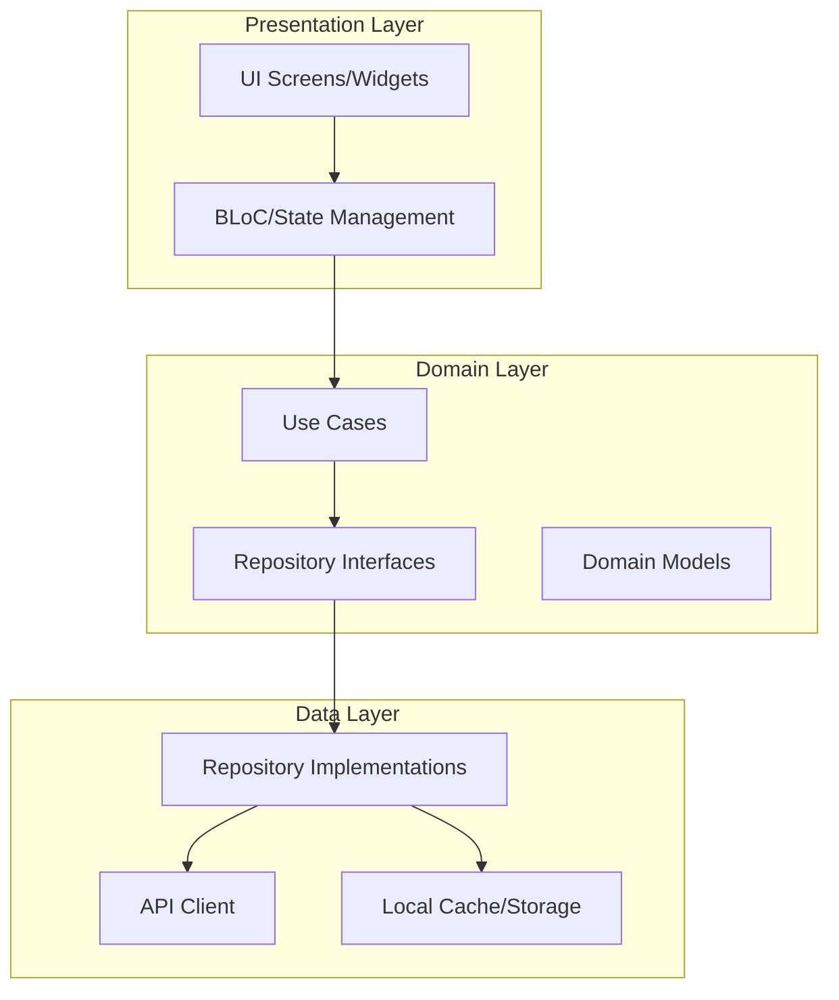

# Aplano - Multi-Location Time Clock System

## Architecture Design Document

---

## 1. Project Overview

**Project Name:** Aplano  
**Type:** Flutter Mobile Application (iOS/Android)  
**Core Functionality:** A multi-location employee time tracking and scheduling system that enables employees to clock in/out, manage schedules, request absences, and facilitates team communication.

---

## 2. Current Architecture Analysis

### 2.1 Existing Structure

```
lib/
├── core/                    # Core utilities and theme
│   ├── theme/
│   │   ├── app_colors.dart      ✓ Implemented
│   │   ├── app_dimensions.dart  ✓ Implemented
│   │   ├── app_text_styles.dart ✓ Implemented
│   │   └── app_theme.dart       ✓ Implemented
│   └── utils/
│       ├── date_formatter.dart  ✓ Implemented
│       └── validators.dart      ✓ Implemented
├── models/                  # Data models
│   ├── absence.dart          ✓ Implemented
│   ├── absence_summary.dart  ✓ Implemented
│   ├── activity_model.dart   ✓ Implemented
│   ├── location.dart         ✓ Implemented
│   ├── shift_model.dart      ✓ Implemented
│   ├── user_model.dart       ✗ Empty - needs implementation
│   ├── work_location_model.dart ✓ Implemented
│   └── workplace_location.dart ✓ Implemented
├── repositories/            # Data access layer
│   ├── absence_repository.dart  ✓ Mock implemented
│   ├── clock_repository.dart    ✓ Mock implemented
│   └── shift_repository.dart   ✓ Mock implemented
├── pages/                    # UI screens
│   ├── navigation_shell.dart   ✓ Implemented (updated)
│   ├── absence/
│   │   ├── absence_page.dart      ✓ Implemented (fixed)
│   │   ├── confirmation_page.dart ✓ Implemented
│   │   ├── new_absence_page.dart  ✓ Implemented
│   │   └── request_history.dart   ✓ Implemented
│   ├── auth/
│   │   ├── login_page.dart     ✓ UI implemented
│   │   └── signup_page.dart   ✓ UI implemented
│   ├── chat/
│   │   └── chat_page.dart     ✓ Implemented
│   ├── dashboard/
│   │   └── dashboard.dart      ✓ Implemented
│   ├── notification/
│   │   └── notification_page.dart ✓ Implemented
│   ├── onboarding/
│   │   └── onboarding.dart     ✓ Implemented
│   ├── profile/
│   │   ├── availability_page.dart ✓ Implemented
│   │   └── menu_page.dart     ✓ Implemented
│   ├── schedule/
│   │   ├── myschedule.dart    ✓ Implemented
│   │   └── teamschedule.dart  ✓ Implemented
│   └── time_tracking/
│       ├── clockin_page.dart  ✓ Implemented
│       └── time_account_page.dart ✓ Implemented
└── widgets/                  # Reusable UI components
    ├── absence/
    │   ├── absence_card.dart
    │   ├── absence_card_expandable.dart
    │   ├── absence_list_card.dart
    │   └── absence_summary_card.dart
    ├── Buttons/
    │   ├── destructive_button.dart
    │   ├── floating_action_button.dart
    │   ├── icon_text_button.dart
    │   ├── primary_button.dart
    │   └── secondary_button.dart
    ├── clockIn/
    │   ├── location_card.dart
    │   ├── location_map_preview.dart
    │   ├── on_duty_status.dart
    │   ├── recent_activity.dart
    │   └── today_shift_card.dart
    ├── common/
    │   ├── custom_app_bar.dart
    │   └── section_header.dart
    └── input/
        ├── custom_text_field.dart
        └── date_picker_field.dart
```

### 2.2 Current Navigation Structure (Bottom Nav - 8 Tabs)

1. **Dashboard** - Home view
2. **My Schedule** - Personal schedule
3. **Team Schedule** - Team view
4. **Clock In/Out** - Time tracking
5. **Absences** - Absence management
6. **Chat** - Team communication
7. **Notifications** - Alerts
8. **Profile/Menu** - User settings

---

## 3. Architecture Recommendations

### 3.1 Recommended Architecture Pattern: Clean Architecture + BLoC



### 3.2 State Management

**Recommended:** flutter_bloc (BLoC pattern)

**Required Providers:**
- `AuthProvider` - Authentication state, user session
- `UserProvider` - Current user data
- `ScheduleProvider` - Shift and schedule data
- `AbsenceProvider` - Absence requests and history
- `NotificationProvider` - Push notifications
- `ThemeProvider` - App theme (light/dark)

### 3.3 Data Layer

**Required Additions:**
```
lib/
├── core/
│   ├── network/
│   │   ├── api_client.dart       # HTTP client wrapper
│   │   ├── api_config.dart       # API endpoints
│   │   └── api_exceptions.dart   # Custom exceptions
│   └── storage/
│       └── local_storage.dart    # SharedPreferences/Hive
├── repositories/                  # Add real implementations
│   ├── impl/
│   │   ├── absence_repository_impl.dart
│   │   ├── clock_repository_impl.dart
│   │   └── shift_repository_impl.dart
│   └── user_repository.dart      # New
└── providers/                     # State management
    ├── auth_provider.dart
    ├── user_provider.dart
    ├── schedule_provider.dart
    ├── absence_provider.dart
    └── notification_provider.dart
```

---

## 4. Missing Components

### 4.1 Critical (Blocking Features)

| Component | Status | Priority |
|-----------|--------|----------|
| User Model | Empty file | HIGH |
| Auth State Management | Not implemented | HIGH |
| API Client | Not implemented | HIGH |
| Real Repository Implementations | Mock only | HIGH |
| Onboarding Flow | UI exists, not connected | HIGH |

### 4.2 Important (Enhancements)

| Component | Status | Priority |
|-----------|--------|----------|
| Local Storage/Persistence | Not implemented | MEDIUM |
| Push Notifications | Not implemented | MEDIUM |
| Offline Support | Not implemented | MEDIUM |
| Error Handling Layer | Not implemented | MEDIUM |
| Loading States | Inconsistent | MEDIUM |

### 4.3 Nice to Have

| Component | Status | Priority |
|-----------|--------|----------|
| Unit Tests | Minimal | LOW |
| Widget Tests | Not implemented | LOW |
| E2E Tests | Not implemented | LOW |
| Analytics | Not implemented | LOW |
| Crash Reporting | Not implemented | LOW |

---

## 5. Data Models - Required Updates

### 5.1 User Model (lib/models/user_model.dart)

```dart
class UserModel {
  final String id;
  final String email;
  final String firstName;
  final String lastName;
  final String? avatarUrl;
  final String role;
  final List<String> assignedLocationIds;
  final String? primaryLocationId;
  final DateTime createdAt;
  final DateTime? lastLoginAt;
}
```

---

## 6. API Integration Plan

### 6.1 Endpoints Required

```
POST   /api/auth/login
POST   /api/auth/logout
POST   /api/auth/register
GET    /api/users/me
PUT    /api/users/me

GET    /api/shifts
GET    /api/shifts/today
GET    /api/shifts/team

POST   /api/clock/in
POST   /api/clock/out

GET    /api/absences
POST   /api/absences
PUT    /api/absences/{id}
DELETE /api/absences/{id}
GET    /api/absences/summary

GET    /api/notifications
PUT    /api/notifications/{id}/read

GET    /api/locations
GET    /api/locations/{id}/geofence
```

### 6.2 API Client Requirements

- Base URL configuration
- JWT token authentication
- Request/response interceptors
- Error handling
- Retry logic
- Offline caching strategy

---

## 7. Security Considerations

1. **Authentication:** JWT-based with refresh tokens
2. **Storage:** Encrypted storage for sensitive data
3. **API:** HTTPS only, certificate pinning for production
4. **Biometrics:** Optional fingerprint/face for clock-in

---

## 8. Implementation Roadmap

### Phase 1: Foundation (Week 1)
- [ ] Complete User Model
- [ ] Set up API Client
- [ ] Implement Auth Provider
- [ ] Connect Login/Signup to API

### Phase 2: Core Features (Week 2)
- [ ] Real Repository Implementations
- [ ] Schedule integration
- [ ] Time clock integration
- [ ] Absence management integration

### Phase 3: Polish (Week 3)
- [ ] Local storage/persistence
- [ ] Error handling
- [ ] Loading states
- [ ] Offline support

### Phase 4: Quality (Week 4)
- [ ] Unit tests
- [ ] Widget tests
- [ ] Performance optimization
- [ ] Analytics setup

---

## 9. Key Dependencies Required

```yaml
dependencies:
  flutter_bloc: ^8.1.3          # State management
  dio: ^5.4.0                    # HTTP client
  shared_preferences: ^2.2.2    # Local storage
  hive: ^2.2.3                  # Fast local database
  hive_flutter: ^1.1.0          # Hive Flutter bindings
  connectivity_plus: ^5.0.2     # Network status
  geolocator: ^11.0.0           # Location services
  flutter_local_notifications: ^16.3.2  # Push notifications
  go_router: ^13.2.0             # Navigation (optional)
  equatable: ^2.0.5             # Value equality
  json_annotation: ^4.8.1       # JSON serialization
  freezed_annotation: ^2.4.1    # Immutable classes

dev_dependencies:
  build_runner: ^2.4.8
  json_serializable: ^6.7.1
  freezed: ^2.4.6
  mockito: ^5.4.4
  bloc_test: ^9.1.5
```

---

## 10. Summary

The Aplano project has a solid UI foundation with comprehensive screens and components. The main gaps are:

1. **No state management** - UI is static, no real data flow
2. **No API integration** - All repositories use mock data
3. **Empty User Model** - Blocks authentication implementation
4. **No persistence** - Data lost on app restart
5. **Incomplete testing** - Only placeholder tests exist

The recommended path forward is to implement Clean Architecture with BLoC pattern, starting with authentication and user management, then progressively connecting the existing UI to real data.
