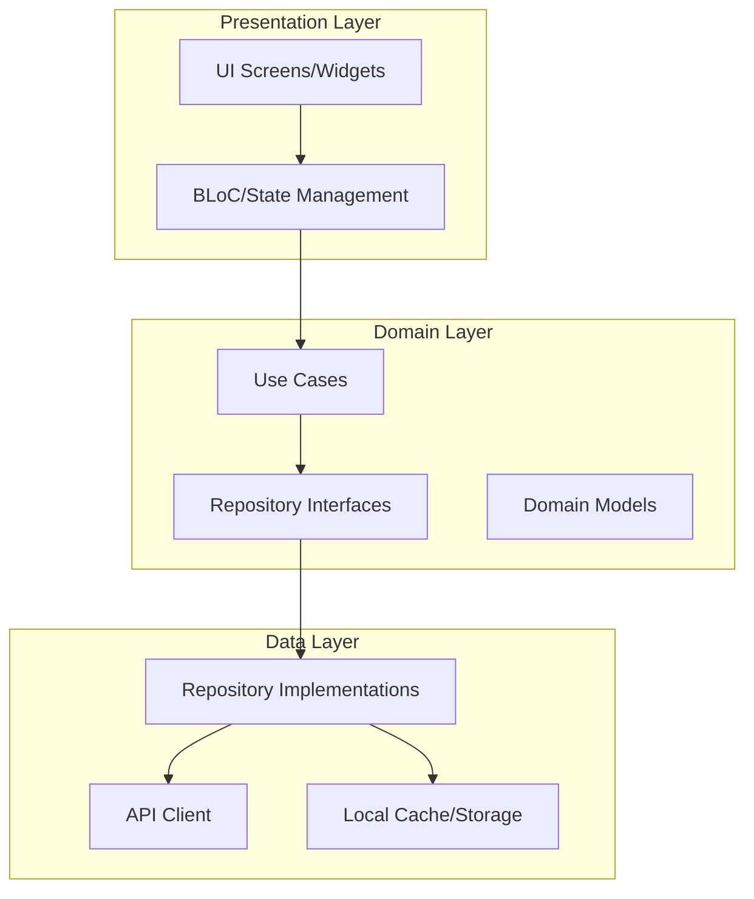

# Wrenta - Multi-Location Time Clock System

## Architecture Design Document

---

## 1. Project Overview

**Project Name:** Wrenta  
**Type:** Flutter Mobile Application (iOS/Android)  
**Core Functionality:** A multi-location employee time tracking and scheduling system that enables employees to clock in/out, manage schedules, request absences, and facilitates team communication.

---

## 2. Current Architecture Analysis

### 2.1 Existing Structure

```
lib/
├── core/                    # Core utilities and theme
│   ├── theme/
│   │   ├── app_colors.dart      ✓ Implemented
│   │   ├── app_dimensions.dart  ✓ Implemented
│   │   ├── app_text_styles.dart ✓ Implemented
│   │   └── app_theme.dart       ✓ Implemented
│   └── utils/
│       ├── date_formatter.dart  ✓ Implemented
│       └── validators.dart      ✓ Implemented
├── models/                  # Data models
│   ├── absence.dart          ✓ Implemented
│   ├── absence_summary.dart  ✓ Implemented
│   ├── activity_model.dart   ✓ Implemented
│   ├── location.dart         ✓ Implemented
│   ├── shift_model.dart      ✓ Implemented
│   ├── user_model.dart       ✗ Empty - needs implementation
│   ├── work_location_model.dart ✓ Implemented
│   └── workplace_location.dart ✓ Implemented
├── repositories/            # Data access layer
│   ├── absence_repository.dart  ✓ Mock implemented
│   ├── clock_repository.dart    ✓ Mock implemented
│   └── shift_repository.dart   ✓ Mock implemented
├── pages/                    # UI screens
│   ├── navigation_shell.dart   ✓ Implemented (updated)
│   ├── absence/
│   │   ├── absence_page.dart      ✓ Implemented (fixed)
│   │   ├── confirmation_page.dart ✓ Implemented
│   │   ├── new_absence_page.dart  ✓ Implemented
│   │   └── request_history.dart   ✓ Implemented
│   ├── auth/
│   │   ├── login_page.dart     ✓ UI implemented
│   │   └── signup_page.dart   ✓ UI implemented
│   ├── chat/
│   │   └── chat_page.dart     ✓ Implemented
│   ├── dashboard/
│   │   └── dashboard.dart      ✓ Implemented
│   ├── notification/
│   │   └── notification_page.dart ✓ Implemented
│   ├── onboarding/
│   │   └── onboarding.dart     ✓ Implemented
│   ├── profile/
│   │   ├── availability_page.dart ✓ Implemented
│   │   └── menu_page.dart     ✓ Implemented
│   ├── schedule/
│   │   ├── myschedule.dart    ✓ Implemented
│   │   └── teamschedule.dart  ✓ Implemented
│   └── time_tracking/
│       ├── clockin_page.dart  ✓ Implemented
│       └── time_account_page.dart ✓ Implemented
└── widgets/                  # Reusable UI components
    ├── absence/
    │   ├── absence_card.dart
    │   ├── absence_card_expandable.dart
    │   ├── absence_list_card.dart
    │   └── absence_summary_card.dart
    ├── Buttons/
    │   ├── destructive_button.dart
    │   ├── floating_action_button.dart
    │   ├── icon_text_button.dart
    │   ├── primary_button.dart
    │   └── secondary_button.dart
    ├── clockIn/
    │   ├── location_card.dart
    │   ├── location_map_preview.dart
    │   ├── on_duty_status.dart
    │   ├── recent_activity.dart
    │   └── today_shift_card.dart
    ├── common/
    │   ├── custom_app_bar.dart
    │   └── section_header.dart
    └── input/
        ├── custom_text_field.dart
        └── date_picker_field.dart
```

### 2.2 Current Navigation Structure (Bottom Nav - 8 Tabs)

1. **Dashboard** - Home view
2. **My Schedule** - Personal schedule
3. **Team Schedule** - Team view
4. **Clock In/Out** - Time tracking
5. **Absences** - Absence management
6. **Chat** - Team communication
7. **Notifications** - Alerts
8. **Profile/Menu** - User settings

---

## 3. Architecture Recommendations

### 3.1 Recommended Architecture Pattern: Clean Architecture + BLoC



### 3.2 State Management

**Recommended:** flutter_bloc (BLoC pattern)

**Required Providers:**
- `AuthProvider` - Authentication state, user session
- `UserProvider` - Current user data
- `ScheduleProvider` - Shift and schedule data
- `AbsenceProvider` - Absence requests and history
- `NotificationProvider` - Push notifications
- `ThemeProvider` - App theme (light/dark)

### 3.3 Data Layer

**Required Additions:**
```
lib/
├── core/
│   ├── network/
│   │   ├── api_client.dart       # HTTP client wrapper
│   │   ├── api_config.dart       # API endpoints
│   │   └── api_exceptions.dart   # Custom exceptions
│   └── storage/
│       └── local_storage.dart    # SharedPreferences/Hive
├── repositories/                  # Add real implementations
│   ├── impl/
│   │   ├── absence_repository_impl.dart
│   │   ├── clock_repository_impl.dart
│   │   └── shift_repository_impl.dart
│   └── user_repository.dart      # New
└── providers/                     # State management
    ├── auth_provider.dart
    ├── user_provider.dart
    ├── schedule_provider.dart
    ├── absence_provider.dart
    └── notification_provider.dart
```

---

## 4. Missing Components

### 4.1 Critical (Blocking Features)

| Component | Status | Priority |
|-----------|--------|----------|
| User Model | Empty file | HIGH |
| Auth State Management | Not implemented | HIGH |
| API Client | Not implemented | HIGH |
| Real Repository Implementations | Mock only | HIGH |
| Onboarding Flow | UI exists, not connected | HIGH |

### 4.2 Important (Enhancements)

| Component | Status | Priority |
|-----------|--------|----------|
| Local Storage/Persistence | Not implemented | MEDIUM |
| Push Notifications | Not implemented | MEDIUM |
| Offline Support | Not implemented | MEDIUM |
| Error Handling Layer | Not implemented | MEDIUM |
| Loading States | Inconsistent | MEDIUM |

### 4.3 Nice to Have

| Component | Status | Priority |
|-----------|--------|----------|
| Unit Tests | Minimal | LOW |
| Widget Tests | Not implemented | LOW |
| E2E Tests | Not implemented | LOW |
| Analytics | Not implemented | LOW |
| Crash Reporting | Not implemented | LOW |

---

## 5. Data Models - Required Updates

### 5.1 User Model (lib/models/user_model.dart)

```dart
class UserModel {
  final String id;
  final String email;
  final String firstName;
  final String lastName;
  final String? avatarUrl;
  final String role;
  final List<String> assignedLocationIds;
  final String? primaryLocationId;
  final DateTime createdAt;
  final DateTime? lastLoginAt;
}
```

---

## 6. API Integration Plan

### 6.1 Endpoints Required

```
POST   /api/auth/login
POST   /api/auth/logout
POST   /api/auth/register
GET    /api/users/me
PUT    /api/users/me

GET    /api/shifts
GET    /api/shifts/today
GET    /api/shifts/team

POST   /api/clock/in
POST   /api/clock/out

GET    /api/absences
POST   /api/absences
PUT    /api/absences/{id}
DELETE /api/absences/{id}
GET    /api/absences/summary

GET    /api/notifications
PUT    /api/notifications/{id}/read

GET    /api/locations
GET    /api/locations/{id}/geofence
```

### 6.2 API Client Requirements

- Base URL configuration
- JWT token authentication
- Request/response interceptors
- Error handling
- Retry logic
- Offline caching strategy

---

## 7. Security Considerations

1. **Authentication:** JWT-based with refresh tokens
2. **Storage:** Encrypted storage for sensitive data
3. **API:** HTTPS only, certificate pinning for production
4. **Biometrics:** Optional fingerprint/face for clock-in

---

## 8. Implementation Roadmap

### Phase 1: Foundation (Week 1)
- [ ] Complete User Model
- [ ] Set up API Client
- [ ] Implement Auth Provider
- [ ] Connect Login/Signup to API

### Phase 2: Core Features (Week 2)
- [ ] Real Repository Implementations
- [ ] Schedule integration
- [ ] Time clock integration
- [ ] Absence management integration

### Phase 3: Polish (Week 3)
- [ ] Local storage/persistence
- [ ] Error handling
- [ ] Loading states
- [ ] Offline support

### Phase 4: Quality (Week 4)
- [ ] Unit tests
- [ ] Widget tests
- [ ] Performance optimization
- [ ] Analytics setup

---

## 9. Key Dependencies Required

```yaml
dependencies:
  flutter_bloc: ^8.1.3          # State management
  dio: ^5.4.0                    # HTTP client
  shared_preferences: ^2.2.2    # Local storage
  hive: ^2.2.3                  # Fast local database
  hive_flutter: ^1.1.0          # Hive Flutter bindings
  connectivity_plus: ^5.0.2     # Network status
  geolocator: ^11.0.0           # Location services
  flutter_local_notifications: ^16.3.2  # Push notifications
  go_router: ^13.2.0             # Navigation (optional)
  equatable: ^2.0.5             # Value equality
  json_annotation: ^4.8.1       # JSON serialization
  freezed_annotation: ^2.4.1    # Immutable classes

dev_dependencies:
  build_runner: ^2.4.8
  json_serializable: ^6.7.1
  freezed: ^2.4.6
  mockito: ^5.4.4
  bloc_test: ^9.1.5
```

---

## 10. Summary

The Wrenta project has a solid UI foundation with comprehensive screens and components. The main gaps are:

1. **No state management** - UI is static, no real data flow
2. **No API integration** - All repositories use mock data
3. **Empty User Model** - Blocks authentication implementation
4. **No persistence** - Data lost on app restart
5. **Incomplete testing** - Only placeholder tests exist

The recommended path forward is to implement Clean Architecture with BLoC pattern, starting with authentication and user management, then progressively connecting the existing UI to real data.

### Revised Plan for Enterprise MVP (100+ Users)

Your original plan is solid for a quick MVP, but targeting enterprise scale (100+ users) with paying customers shifts priorities toward **reliability, security, and compliance from day one**. Solo dev remains tight, so we'll compress Phases 4-6 into Weeks 3-4, cut non-essentials (chat stub, notifications), and front-load enterprise must-haves. Total: **4 weeks** to launch-ready. Focus: No crashes, secure auth, audit-ready logging, basic offline. Backend assumptions hold (your API endpoints).

Key changes:
- **Elevate security/compliance to Week 2**: Use `flutter_secure_storage` immediately; add analytics/logging.
- **Compress polish/testing**: Parallelize with core integration; mandatory device QA weekly.
- **Add enterprise basics**: User auditing, multi-location, crash reporting (Sentry/Firebase).
- **Cut scope**: Skip Phase 7 refactor, notifications, chat. Add post-launch only.
- **Dependencies upfront**: `dio: ^5.x`, `flutter_secure_storage: ^9.x`, `sentry_flutter: ^8.x` (or Firebase Crashlytics), `shared_preferences`.

***

### Week 1: API Foundation & Secure Authentication
Same as original, but enterprise-secure.

- Set up `core/network/` (Dio client with JWT interceptors, `api_config.dart`, exceptions).
- **Secure auth**: 
  - Login → `POST /api/auth/login`; store **access + refresh tokens** in `flutter_secure_storage` via extended `prefs_service.dart`.
  - App start: Check/refresh token; fallback to `AuthStatus.unauthenticated`.
  - Add `secure_storage_service.dart` wrapper: `saveTokens()`, `getTokens()`, `clearTokens()`.
- Complete `UserModel` (add `id, email, firstName, lastName, role, assignedLocationIds, locations[]` with `fromJson/toJson`).
- `UserRepository`: `getMe()`, `updateProfile()` (real calls).
- Wire `login_page.dart`: Real calls, loading, SnackBar errors.
- **Enterprise add**: Integrate Sentry in `main.dart` for crash reporting; log auth events (`sentry.captureMessage('User logged in: ${user.id}')`).

**Deliverable**: Secure login persists across restarts; crashes logged remotely. Test: Real credentials on iOS/Android emulators.

***

### Week 2: Core Features + Enterprise Security/Logging
Wire repos/UI as original, but add logging, multi-location, validation.

- **Repositories** (real API, error handling via SnackBar):
  | Feature | Methods | Endpoints | Notes |
  |---------|---------|-----------|-------|
  | Shifts | `getShifts()`, `getTodayShift()`, `getTeamSchedule(date)` | `/api/shifts`, `/shifts/today`, `/shifts/team?date={}` | Cache todayShift in secure prefs for offline peek. |
  | Clock | `clockIn(locationId)`, `clockOut()`, `getTodayActivity()` | `/api/clock/in`, `/out`, `/activities/today` | GPS geofence vs. user's `assignedLocationIds`; log activity ID. |
  | Absences | `getAbsences()`, `createAbsence()`, `updateAbsence(id)`, `getAbsenceSummary()` | `/api/absences`, `POST`, `PUT/{id}`, `/summary` | Client-side validation via `validators.dart`. |

- Wire pages (`dashboard_provider.dart`, `myschedule.dart`, `teamschedule.dart`, `clockin_page.dart`, absence pages): Real data, loading states.
- **Enterprise adds**:
  - Fetch/store `locations[]` in `UserModel` post-login; `clockin_page.dart` shows dropdown for multi-location.
  - Global logging: `core/error/error_handler.dart` → Sentry for all errors + user-facing messages (e.g., "Network error, retrying...").
  - Input validation: Inline errors on forms (login, absences).
  - Token refresh: `POST /api/auth/refresh` on 401; clear/redirect if fails.

**Deliverable**: Full core flows work with real data; multi-location clocking; all errors logged to Sentry. Test: Full journey on physical devices.

***

### Week 3: Stabilization, Offline Basics, Compliance
Parallel polish + enterprise hardening. No new features.

- **Global UX**: `LoadingOverlay` widget; debounce buttons; 10s timeout → "Retrying...".
- **Offline basics**: Cache shifts/absences/summary in `shared_preferences` (JSON); show cached on no-network, queue clock/absence → retry on reconnect.
- **Compliance/audit**:
  - Analytics: Track key events (`login`, `clockIn(id:123)`, `absenceCreate(id:456)`) via Sentry or backend `/api/analytics`.
  - Privacy: Add "Privacy Policy" + "Terms" links in `menu_page.dart` (external URLs); require terms accept on first login.
  - Secure storage: All tokens/user data in `flutter_secure_storage`.
- **Token security**: Auto-refresh pre-emptively (e.g., on app foreground).
- Manual QA: Checklist runs (network fail, expiry, edge inputs); fix crashes.

**Deliverable**: App handles offline/network fails gracefully; auditable logs; no raw errors to users.

***

### Week 4: Pre-Launch Hardening & Scale Prep
Final QA + production tweaks for 100+ users.

- **Performance**: DevTools profile; cache user data; lazy-load lists in `teamschedule.dart`, `absence_page.dart`.
- **Testing**:
  - Device matrix: iOS/Android (2 sizes each), session expiry, geofence edges.
  - Mock API tests: Unit for models/validators/repos (skip widgets).
- **Scale adds**:
  - Certificate pinning in `Dio` (if backend provides cert).
  - Monitor: API response times logged to Sentry.
- **Launch checklist**:
  - [ ] No crashes in QA.
  - [ ] Offline shows data.
  - [ ] Secure tokens persist.
  - [ ] Logs capture user actions.
  - Build/release to TestFlight/Play Console internal test.

**Post-Launch (Month 2+)**: Add push (`firebase_messaging`), full offline queue, BLoC refactor based on feedback. Monitor Sentry for issues.

***

### Why These Changes Work for Enterprise
- **Security first**: Tokens encrypted day 1; refresh + pinning prevents leaks.
- **Reliability**: Offline/caching + Sentry = 99% uptime feel for 100+ users.
- **Compliance**: Audit trail via logs; basic GDPR (export stub if needed).
- **Timeline feasible**: Cuts fluff (notifications/chat); leverages existing UI/providers.
- **Cost to payors**: Stable MVP justifies enterprise pricing.

This gets you launch-ready in 4 weeks. Track daily progress against deliverables—adjust Week 4 if Weeks 1-2 slip. Need code snippets for `secure_storage_service.dart` or Dio pinning?


Backend plan aligns with your enterprise Flutter MVP (100+ users, security/compliance-first). Assumes you're building/maintaining the API yourself alongside frontend. Use **Node.js/Express + PostgreSQL** (fastest solo setup) or **Spring Boot** if Java team exists. Deploy to **AWS/DigitalOcean** with auto-scaling. Total: **Parallel to frontend Weeks 1-4**, then harden.

## Core Architecture
- **Stack**: RESTful API (JSON), JWT auth (access/refresh tokens), PostgreSQL (audit-ready).
- **Key Principles**: Design-first (OpenAPI spec), rate limiting, consistent errors, pagination. [genuinestack](https://www.genuinestack.com/blog/building-scalable-apis-enterprise-best-practices)
- **Database**: 
  | Table | Fields | Indexes | Enterprise Notes |
  |-------|--------|---------|------------------|
  | users | id, email, firstName, lastName, role, assignedLocationIds[] | email (unique), role | Role-based access (RBAC) |
  | shifts | id, userId, start, end, locationId | userId, date range | Multi-location support |
  | clock_activities | id, userId, type(in/out), timestamp, locationId, lat/lng | userId, date | Audit trail (immutable) |
  | absences | id, userId, type, start, end, status | userId, status, date | Approval workflow |

## Week 1-2: MVP Endpoints (Match Frontend Plan)
Implement exact endpoints from your Flutter plan. Secure with middleware.

```
Auth (/api/auth):
- POST /login {email, password} → {accessToken, refreshToken, user}
- POST /refresh {refreshToken} → {accessToken}
- GET /me → user profile + locations[]

Shifts (/api/shifts):
- GET / → user's shifts (paginated)
- GET /today → today's shift
- GET /team?date=YYYY-MM-DD → team schedule

Clock (/api/clock):
- POST /in {locationId} → activity + geofence check
- POST /out → activity
- GET /activities/today → list

Absences (/api/absences):
- GET / → user's absences
- POST / {type, start, end} → create (pending status)
- PUT /{id} → update
- GET /summary → stats (counts by type/status)
```

**Security Baseline** (Week 1):
```
- JWT middleware: Verify access token on protected routes
- Input validation: Joi/Zod schemas for ALL requests
- Rate limiting: 100 req/min per IP (express-rate-limit)
- HTTPS enforced; CORS restricted to your app domains
- SQL injection prevention: ORM (Prisma/Sequelize) or parameterized queries
```

## Week 3: Enterprise Hardening
**Scale & Reliability**:
- **Pagination**: All GET lists: `?page=1&limit=20&sort=start:desc`
- **Caching**: Redis for shifts/summaries (1hr TTL); ETag headers.
- **Error Format**: `{error: {code: 'VALIDATION_ERROR', message: 'Invalid date', details: [...]}}` [group107](https://group107.com/blog/api-development-best-practices/)
- **Logging**: Structured logs (Winston) to file + CloudWatch/DataDog. Log userId, endpoint, status, duration.
- **Monitoring**: Prometheus metrics (response time, error rate, active users).

**Compliance**:
```
Audit log table: {userId, action, resourceId, timestamp, ip, userAgent}
Auto-log: clockIn/Out, absence create/update, login attempts
GDPR: GET /export?format=json → all user data
```

## Week 4: Production Deployment
```
Infra (DigitalOcean App Platform or AWS ECS):
- 2x Node.js containers (auto-scale on CPU>70%)
- PostgreSQL managed (RDS/Supabase)
- Redis cluster
- Load balancer + WAF (Cloudflare)

CI/CD:
- GitHub Actions: Lint → Test → Deploy
- Tests: 80% coverage (unit + integration)
  - Jest/Supertest: Mock DB, test all endpoints + errors
  - Contract tests: Match OpenAPI spec
```

**Rate Limits & Quotas**:
```
Per user: 500 req/hour
Per IP: 2000 req/hour
Enterprise: Burst 10 req/sec, smooth to 2 req/sec
```

## OpenAPI Documentation (Week 1 Start)
Generate interactive docs (`/docs`):
```
npm i swagger-ui-express swagger-jsdoc
```
Include schemas, examples, auth flows. Critical for enterprise clients.

## Post-Launch (Month 2+)
```
Phase 2 (100+ users confirmed):
- WebSocket: Real-time team schedule updates
- Admin API: /api/admin/users, /api/admin/reports
- Queue: BullMQ for email notifications, failed clock-ins
- Multi-tenancy: tenantId in JWT, DB partitioning
```

## Tech Stack Recommendation
```
**Fastest Solo (Node.js)**:
express + prisma + jwt + redis + pg + swagger
Deploy: DigitalOcean App Platform ($12/mo starter)

**Enterprise-Ready (Java)**:
Spring Boot + Spring Security + JPA/Hibernate + Redis
Deploy: AWS ECS Fargate

**Serverless (if no ops team)**:
Supabase (Postgres + Auth) + Vercel/Netlify Functions
```

## Critical Decisions
- **No GraphQL**: REST simpler for MVP, easier RBAC
- **JWT > Sessions**: Stateless scales better
- **PostgreSQL > Mongo**: ACID transactions for clock/audit
- **Prisma > Raw SQL**: Schema migrations, type-safety
- **Cloudflare**: Free WAF, CDN, DDoS protection

This matches your Flutter frontend endpoints exactly while building enterprise-grade from day one. Backend dev can run parallel to frontend Weeks 1-2 (you or contractor). Need Prisma schema or OpenAPI spec template?